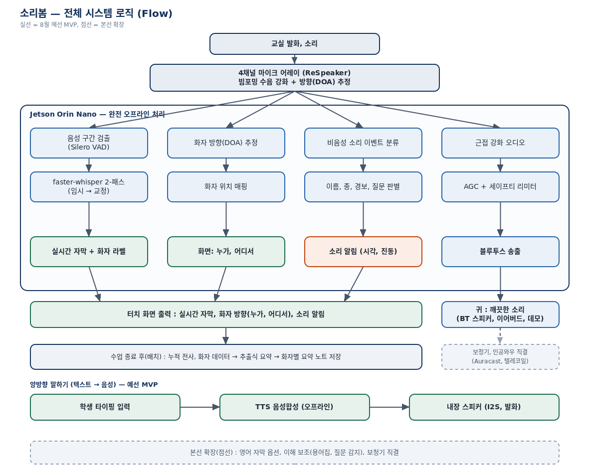
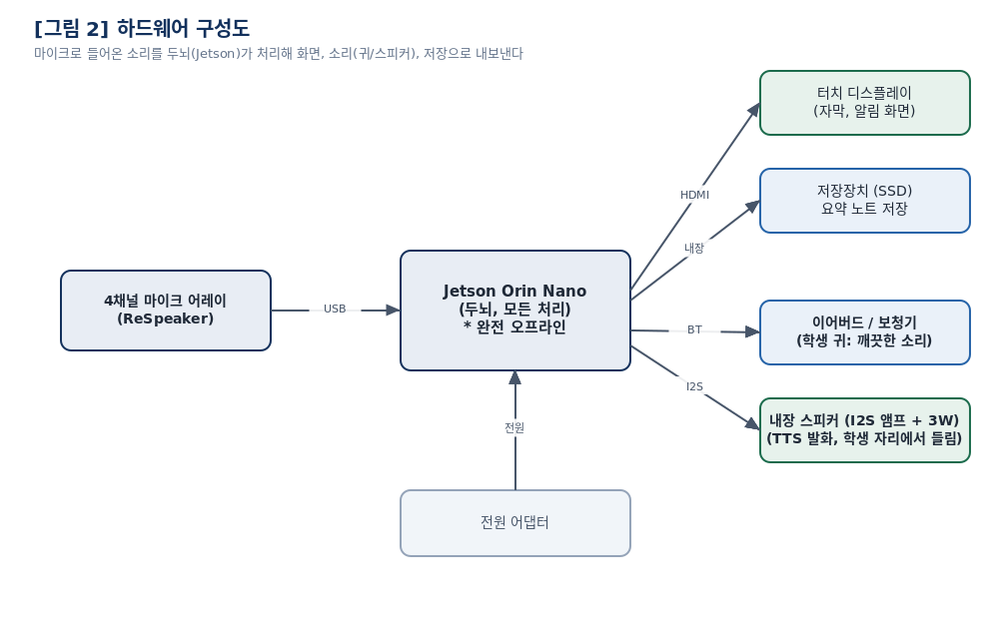
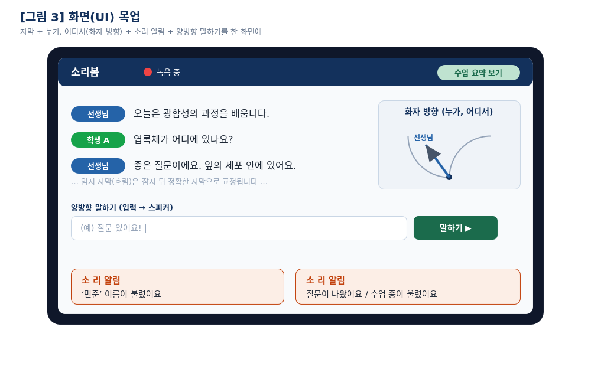

# 소리봄 (SoundSight)

> 청각장애 학생이 교실 수업을 놓치지 않도록 돕는, **인터넷 없이 작동하는** 교실용 청각 보조 단말기

**팀 제주 BTS (Beyond the Sound)** · 2026 제8회 한국코드페어 SW공모전 고등부

---

## 우리가 풀려는 문제

청각장애·난청 학생은 교실에서 이런 어려움을 겪습니다.

- 여러 명이 동시에 말할 때 **누가, 어디서** 말하는지 알기 어렵다
- 선생님이 **이름을 부르거나, 종이 울리거나, 질문을 던져도** 놓치기 쉽다
- 수업 내용을 실시간으로 따라가기도, 끝나고 복습하기도 어렵다
- 하고 싶은 말이 있어도 **발화가 어려워 참여하지 못한다**

시중에도 자막 안경 같은 제품이 있지만 대부분 **인터넷 연결이 필요**합니다. 교실의 대화가
외부 서버로 나간다는 뜻이고, 학교 와이파이가 불안정하면 그대로 멈춥니다.

소리봄은 **모든 처리를 기기 안에서** 합니다. 교실의 음성은 밖으로 한 발자국도 나가지 않습니다.

## 여섯 가지 기능

| | 기능 | 설명 |
|---|---|---|
| ① | **실시간 자막** | 선생님·친구의 말을 화면에 글자로 표시 (2-패스: 빠른 임시 자막 → 정확한 교정 자막) |
| ② | **누가·어디서** | 4채널 마이크로 소리 방향(DOA)을 추정해 화자 위치를 화면에 표시 |
| ③ | **소리 알림** | 이름 호명, 종소리, 질문 등 말이 아닌 소리도 감지해 알림 |
| ④ | **깨끗한 소리 전달** | 또렷하게 모은 소리를 블루투스로 이어버드·보청기에 전달 |
| ⑤ | **수업 요약 노트** | 수업이 끝나면 화자별 핵심 내용을 정리해 복습 노트로 저장 |
| ⑥ | **양방향 말하기** | 학생이 타이핑하면 단말 내장 스피커가 대신 말한다 (TTS) |

⑥은 스피커를 **단말에 내장**한 것이 핵심입니다. 교실 벽 스피커에서 소리가 나면 반 친구들이
"누가 말했는지" 알 수 없지만, 학생 자리에서 소리가 나면 방향으로 화자를 자연스럽게 인식합니다.

## 시스템 구조

모든 연산은 NVIDIA Jetson Orin Nano 안에서 **완전 오프라인**으로 이뤄집니다.

## 기술 스택

| 영역 | 선택 | 이유 |
|---|---|---|
| 연산 | NVIDIA Jetson Orin Nano (67 TOPS) | 엣지에서 STT를 실시간으로 돌릴 수 있는 최소 사양 |
| 수음 | ReSpeaker Mic Array v3.0 (XMOS XVF-3000) | 빔포밍·DOA·에코제거를 칩에서 처리 → Jetson 부담 경감 |
| 음성 인식 | faster-whisper (CTranslate2, int8) | 오프라인 한국어 STT. 2-패스로 지연과 정확도를 동시에 해결 |
| 음성 구간 검출 | Silero VAD | 말이 없는 구간을 걸러 연산 낭비 방지 |
| 음성 합성 | Piper | 오프라인 한국어 TTS, Jetson에서 1초 이내 |
| 음성 출력 | MAX98357A (I2S) + 4Ω 스피커 | 단말 내장 스피커 구동 |

## 문서

- [문제 정의](docs/01-problem.md)
- [시스템 설계](docs/02-system-design.md)
- [하드웨어 구성과 배선](docs/03-hardware.md)
- [이해도 실험 설계](docs/04-experiment.md)
- [안전 관리](docs/05-safety.md)
- [부품 리스트 (BOM)](hardware/BOM.md)

## 효과 검증

"자막이 나오니 좋아 보인다"에서 그치지 않고, **숫자로 증명**합니다.

같은 학생이 난이도가 비슷한 두 수업을 각각 *단말 사용* / *미사용* 조건으로 듣고 이해도 퀴즈를 봅니다
(조건 순서는 무작위 배정). 대응표본 t-검정으로 점수 차이를 검정하고, 95% 신뢰구간과
효과크기(Cohen's d_z)를 함께 보고합니다. 자세한 설계는 [docs/04-experiment.md](docs/04-experiment.md).

## 안전

- 실제 보청기·인공와우에 큰 소리를 직접 보내는 실험은 **하지 않습니다**
- 모든 음량은 디지털 소음계로 상한을 확인합니다
- 모의 저청력 조건(노이즈캔슬링)은 **안전한 크기, 짧은 시간**으로만 재현합니다

## 개발 현황

- [x] 문제 정의 · 시스템 설계
- [x] 하드웨어 선정 · 부품 확보
- [ ] 오디오 파이프라인 (수음 → VAD → DOA)
- [ ] 2-패스 STT
- [ ] 소리 이벤트 분류
- [ ] TTS 발화 (I2S)
- [ ] UI 통합
- [ ] 이해도 실험 · 통계 분석

## 라이선스

MIT License. [LICENSE](LICENSE) 참고.
