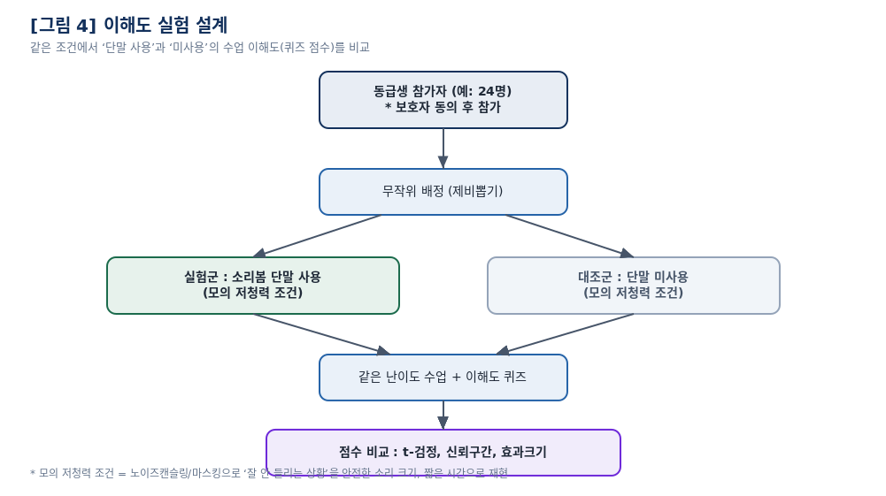

# 4. 이해도 실험 설계

## 연구 질문

> 소리봄 단말을 사용하면, 잘 들리지 않는 상황에서 수업 이해도가 올라가는가?

- **귀무가설 H₀** : 단말 사용 여부에 따른 이해도 퀴즈 점수 차이가 없다 (μ_d = 0)
- **대립가설 H₁** : 단말 사용 시 점수가 더 높다 (μ_d > 0)

## 설계 — 대응표본(within-subject)

같은 학생이 **두 조건을 모두** 경험합니다.

| 조건 | 내용 |
|---|---|
| 실험 | 모의 저청력 + **소리봄 단말 사용** |
| 대조 | 모의 저청력 + 단말 미사용 |

**왜 대응표본인가.** 학생마다 원래 이해력이 다릅니다. 서로 다른 두 집단을 비교하면
그 개인차가 잡음이 되어 진짜 효과를 가립니다. 같은 학생을 두 번 재면 개인차가 상쇄되어
훨씬 적은 인원으로도 효과를 잡아낼 수 있습니다.

**순서 균형(counterbalancing).** 조건 순서(단말 먼저 / 나중)를 무작위로 배정해
학습 효과와 피로 효과를 상쇄합니다. 두 수업은 난이도가 비슷한 별개 주제를 씁니다.

## 표본 크기

검정력 분석 결과:

| 항목 | 값 |
|---|---|
| 기대 효과크기 (Cohen's d_z) | 0.6 (중간~큰 효과) |
| 유의수준 α | .05 (단측) |
| 검정력 (1−β) | .80 |
| **필요 표본 n** | **≈ 24명** |

## 모의 저청력 조건

노이즈캔슬링 헤드폰과 마스킹 소음으로 "잘 안 들리는 상황"을 재현합니다.
**안전한 음량, 짧은 시간**으로만 진행하며 소음계로 상한을 확인합니다.
불편하면 언제든 중단할 수 있습니다.

## 분석

| 지표 | 방법 |
|---|---|
| 효과 검정 | 대응표본 t-검정 (paired t-test) |
| 불확실성 | 평균 차이의 95% 신뢰구간 |
| 효과 크기 | Cohen's d_z |
| 보조 지표 | STT 정확도 (WER), 자막 지연 시간 |

p값 하나만 보고하지 않습니다. **신뢰구간과 효과크기**를 함께 보고해야
"통계적으로 유의하다"가 아니라 "실제로 얼마나 도움이 되는가"를 말할 수 있습니다.

분석 코드: [`experiments/analysis.py`](../experiments/analysis.py)

## 윤리

- 모든 참가자에게 보호자 동의를 받습니다 (연구참가 동의서)
- 실험 데이터는 **익명**으로만 기록합니다 (익명 번호, 학년, 성별, 퀴즈 점수)
- 이름·소속은 동의 확인용으로만 쓰고 연구 종료 직후 폐기합니다
- 원자료는 이 저장소에 커밋하지 않습니다 (`.gitignore`로 차단)
